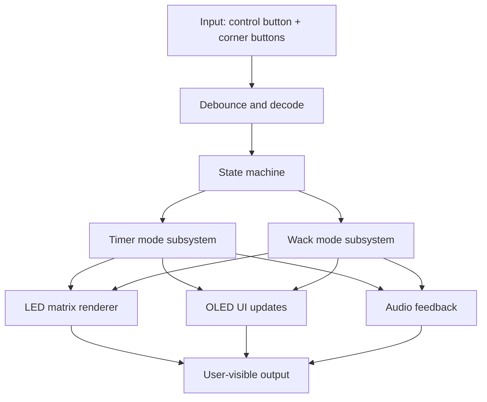

# Firmware Overview

## Purpose

The firmware in this repository provides the functional behavior of the handheld button controller. The code is preserved as the primary product logic and is not rewritten here; instead, this document describes its role in the broader hardware system.

## Software Architecture

The firmware is a single-sketch, state-driven embedded application for the ESP32. Rather than using a full RTOS, it follows a lightweight cooperative loop in which the main program repeatedly reads input, updates game state, and refreshes the output devices. This keeps the implementation simple and easy to debug while still supporting the current timer and reaction-game behavior.

### Execution Model

The program is structured around a very simple control flow:

1. `setup()` initializes serial logging, GPIO pins, the LED matrix, the OLED display, and the initial menu state.
2. `loop()` runs continuously and performs three high-level tasks in order:
   - reads and debounces user input
   - updates the active mode state (timer or wack mode)
   - redraws the OLED screen and LED matrix when needed
3. A `needRedraw` flag is used to avoid unnecessary screen updates and keep the loop responsive.

This approach is well suited for a prototype because it is deterministic and easy to reason about, but it also makes the code structure highly centralized in the main sketch.

### Main Subsystems

#### 1. Input and Control Layer

The firmware reads two different input classes:

- the main control button for menu navigation and mode selection
- four corner buttons used in the wack-style interaction mode

The input handling layer uses GPIO with internal pull-up resistors and a debounce window to avoid false triggers when buttons are pressed or released. The control button also supports a short tap versus a hold, which is used to navigate menus and select modes.

#### 2. State Machine

The firmware operates around a small state machine defined by the `ScreenMode` enum:

- `MENU`: the main selection screen
- `MODE_TIMER`: the countdown timer experience
- `MODE_WACK`: the reaction-style color-change mode

This keeps the logic grouped by interaction mode and ensures that only the relevant subsystem is active at a given time.

#### 3. LED Matrix Rendering Layer

The LED matrix is driven through a pixel-addressing abstraction rather than direct raw writes. The firmware provides helper functions for:

- filling the full matrix with a single color
- placing a pixel at an $(x, y)$ coordinate using a serpentine mapping scheme
- animating a color spread from a chosen origin point

The wack mode uses this layer to create the visual spread effect that appears to originate from the corner or edge pressed by the user.

#### 4. Timer Subsystem

The timer mode uses a simple countdown model based on `millis()` rather than blocking delays. When the timer is entered:

- the countdown is initialized to 60 seconds
- a periodic tick updates the remaining time once per second
- the matrix is redrawn with large digit patterns for the countdown value
- the timer ends by triggering a finish effect and returning to the menu screen

This logic is intentionally lightweight, but it cleanly separates the timer behavior from the rest of the UI and input handling.

#### 5. Wack Mode Subsystem

The wack mode is the most interactive portion of the firmware. It reads a mask of which corner buttons are currently pressed, debounces the state, and then decides how to interpret that input. The system maps combinations of pressed corners to an origin point on the LED matrix and uses that origin to animate a new color spreading across the panel.

This provides the effect described in the project demo: the panel changes color and the spread appears to emerge from the corner or edge that was activated.

#### 6. Display and Feedback Layer

The OLED display is updated through the U8g2 library and is responsible for showing the menu, timer status, and mode instructions. The buzzer provides additional feedback for major actions such as entering a mode, changing color, and finishing the timer. This makes the device feel more responsive even when the visual state is changing.

### Data Flow

A typical event flow looks like this:

1. A button is pressed.
2. The input layer debounces the signal.
3. The active mode handler interprets the event.
4. The mode logic updates internal state, such as a countdown value or a new matrix animation.
5. The rendering layer updates the OLED display and LED matrix.
6. A tone may be played to confirm the action.

This structure keeps the firmware easy to follow and makes it straightforward to extend with new modes or features later.

### Design Notes

The current firmware prioritizes simplicity and clarity over modularity. That makes it ideal as a preserved prototype and a good base for future work. The main tradeoff is that most of the behavior remains centralized in one sketch file, so adding more advanced features such as Wi-Fi, BLE, or multi-device networking will benefit from breaking the logic into smaller modules.

### Why These Design Choices Work

The current architecture is intentionally straightforward:

- A cooperative main loop keeps the firmware deterministic and easy to follow for a prototype.
- A small state machine makes the timer and wack interactions explicit instead of scattering logic across the sketch.
- The LED matrix rendering layer isolates the physical panel mapping so the gameplay code can stay focused on behavior rather than pixel numbering.
- Direct GPIO-based input with debounce keeps the Bill of Materials and wiring simple while still being reliable enough for the current use case.

### Future Architectural Direction

As the project evolves, the same architecture can be expanded into a more modular design with:

- separate modules for input handling, display rendering, LED effects, and mode logic
- a small event queue for asynchronous actions and communication
- a clearer abstraction layer for future wireless features and multi-unit serial control

## GPIO Mapping

The current firmware uses the following general pin allocation:

| Function | GPIO |
| --- | --- |
| Control button | 23 |
| Top-left button | 27 |
| Bottom-left button | 26 |
| Top-right button | 33 |
| Bottom-right button | 32 |
| LED matrix data | 14 |
| Buzzer | 25 |
| OLED SCL | 21 |
| OLED SDA | 22 |

## Driver Notes

- OLED output is handled through the U8g2 library.
- LED effects are driven through the NeoPixel-compatible matrix interface.
- Buttons use input pull-up logic and debouncing.
- Audio feedback is implemented through simple tone output.

## Planned UI and Connectivity Enhancements

The next firmware iteration may add:

- Wi-Fi connectivity for configuration and telemetry
- BLE support for pairing with mobile devices
- Multi-button serial connection for coordinating multiple units

## Build and Flash

The main firmware source is [../../firmware/LED_button.ino](../../firmware/LED_button.ino).

1. Open the firmware file in Arduino IDE or PlatformIO.
2. Select the ESP32 board package.
3. Compile and upload the sketch.
4. Confirm display power, LED output, and button response.

## Power Considerations

The firmware assumes a stable regulated supply to the ESP32 and peripherals. Battery voltage should be verified before deployment.

<!-- Add firmware flow chart or state diagram later -->