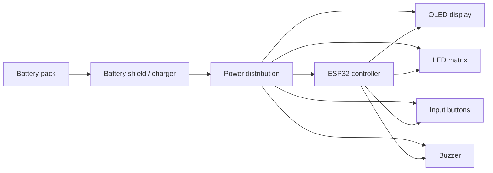

# Hardware Overview

This folder stores the physical design assets for the LED button controller.

## Contents

- [pcb](pcb/): PCB schematic, manufacturing outputs, and connector information
- [cad](cad/): STEP files for the mechanical assemblies and enclosure components
- [stl](stl/): STL output location for printable parts
- [manufacturing](manufacturing/): build and fabrication notes
- [drawings](drawings/): drawing placeholders for future mechanical and assembly documentation

## Design Intent

The hardware revision documented here is a modular prototype platform. It prioritizes flexibility, serviceability, and rapid iteration over production optimization. The design intentionally uses an ESP32 development board, an external battery shield, and JST-XH wiring to simplify debugging and part replacement.

## Hardware Architecture

This layout is chosen because it keeps the device portable and easy to service while still making the PCB the main integration point for the system. The split between modular subsystems and the custom PCB allows future revisions to improve manufacturing density without discarding the existing functional architecture.

## Included Files

- [pcb/LED_Button_PCB_Schematic.pdf](pcb/LED_Button_PCB_Schematic.pdf)
- [pcb/Gerber_LED_BUTTON_2026-07-04.zip](pcb/Gerber_LED_BUTTON_2026-07-04.zip)
- [cad/LED_BUTTON_3DFILES.step](cad/LED_BUTTON_3DFILES.step)
- [cad/LED_BUTTON_VEX_WALL_MOUNT_3D_FILES.step](cad/LED_BUTTON_VEX_WALL_MOUNT_3D_FILES.step)

<!-- Add CAD render or assembly photo here -->